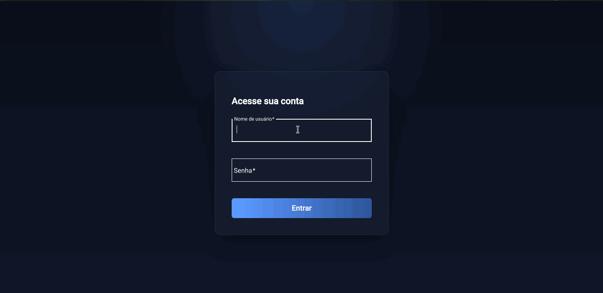
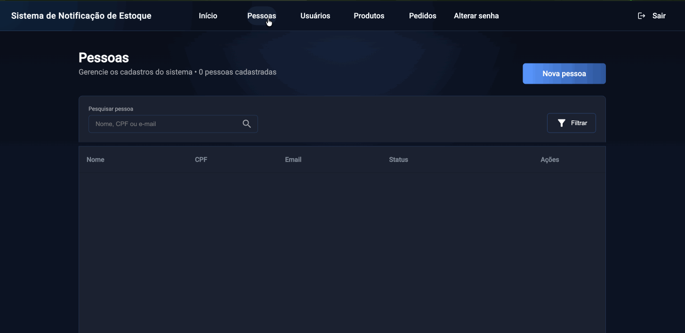
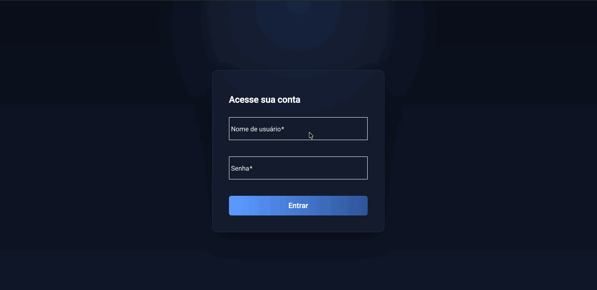
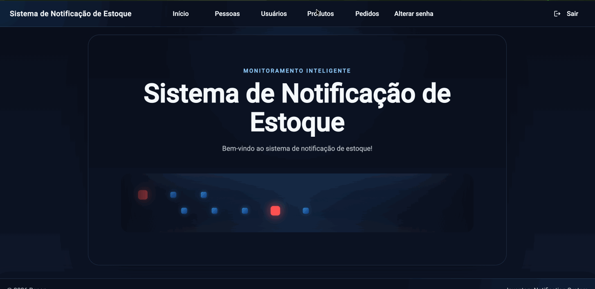
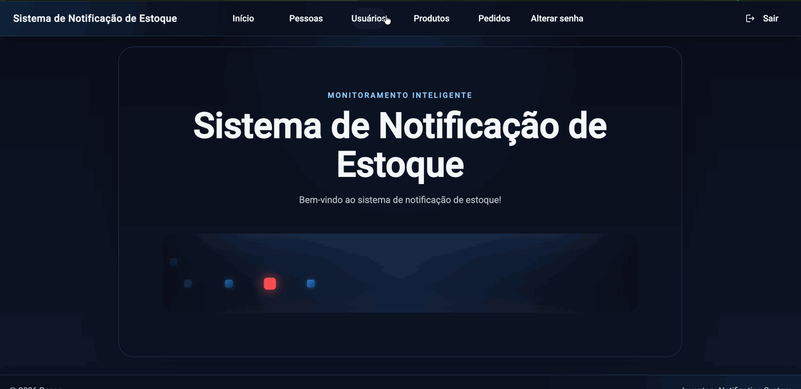
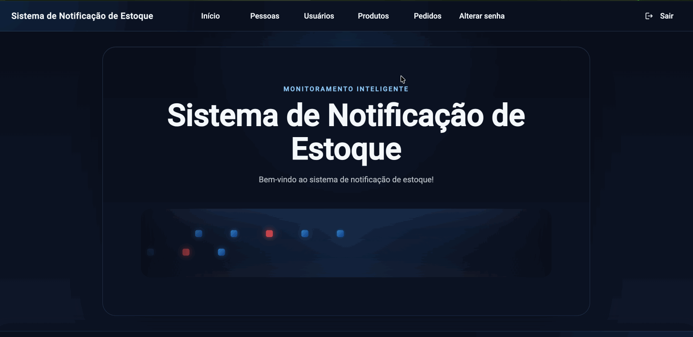
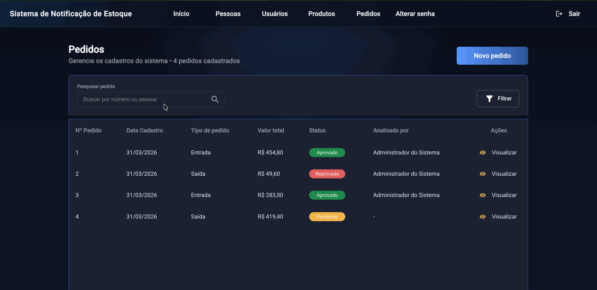
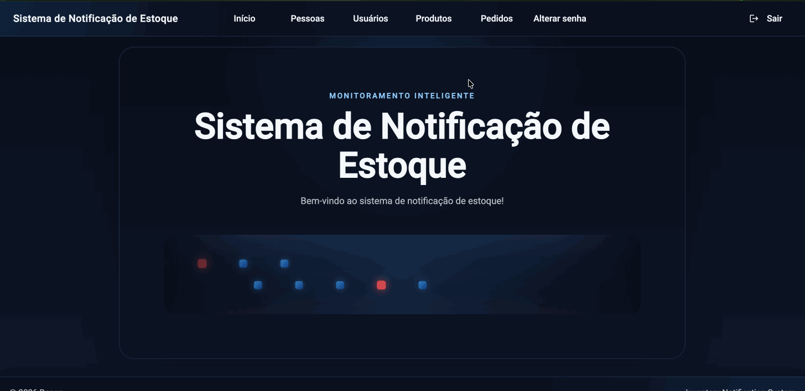
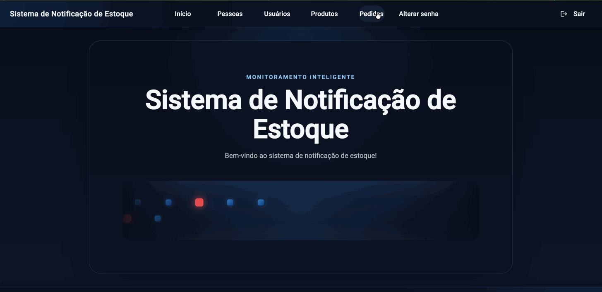
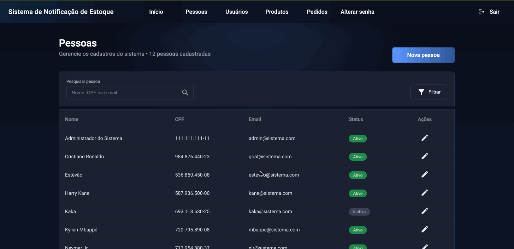

# 🎬 Demonstração da Aplicação

Este documento reúne demonstrações visuais das principais telas e fluxos do Sistema de Notificação de Estoque.

---

## 🌐 Visão Geral do Sistema
Navegação geral pela aplicação, apresentando a experiência principal de uso entre módulos e telas.

---

## 👤 Person & User Flow
Fluxos de listagem, cadastro e edição de pessoas e usuários.

### 📄 Listar pessoas e usuários

### 📝 Cadastrar pessoa e usuário

### ✏️ Editar pessoa e usuário

---

## 📦 Product Flow
Fluxos de listagem, cadastro e edição de produtos.

### 📄 Listar produtos

### 📝 Cadastrar produto

### ✏️ Editar produto

---

## 🧾 Order Flow
Fluxos de listagem, criação e edição de pedidos.

### 📄 Listar pedidos

### 📝 Criar pedido

### ✏️ Editar pedido

---

## 🔐 Update Password
Fluxos de atualização de senha no primeiro acesso e em atualização posterior.

### 🔑 Atualizar senha no primeiro acesso

### 🔑 Atualizar senha

 
<a href="../../README.md">🔄 Voltar para a documentação completa</a>

